<article class="h-entry">

<header>

# Handy Data Visualization Functions in matplotlib & Seaborn to Speed Up Your EDA

</header>
 

---
 

I find myself going through a fairly predictable routine when I look at a new dataset and want to do some EDA before settling on a model strategy. Over time, I’ve come to lean on a few handy functions that keep me from wasting time doing the mundane formatting and setup that matplotlib.pyplot requires. I thought I’d pass these along to the data science community in case it was helpful for others. These code blocks correspond to cells in a Jupyter notebook, but aren’t necessarily bound to that environment.

You can find all of this code within the Jupyter notebook in this Github repository … [here](https://github.com/manukalia/handy_data_viz_functions)

 

---
 

For ease of demonstration, I’ll start out by fetching one of the datasets available via Sklearn, the California housing prices dataset. This happens to be a dataset that lends itself to a regression type problem, but the graphing functions I describe below would work just as well for categoricals and classification-oriented exercises… either as they are, or with minor modifications. When and if you use the plotting functions, you should of course use the dataframe that you have set up and ignore this particular dataset.

First, the basic imports:
    
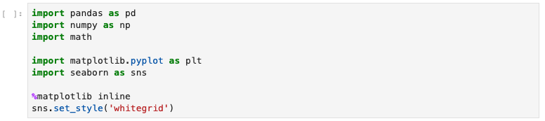 
&nbsp; &nbsp; &nbsp; &nbsp; &nbsp; &nbsp; *fig. 01 ... basic imports*   
    
Then, fetch the demonstration dataset and stick it in a pandas dataframe. There are 20,648 observations in this Sklearn dataset of California housing prices. The 8 feature columns reside in the _dataset.data_ structure.

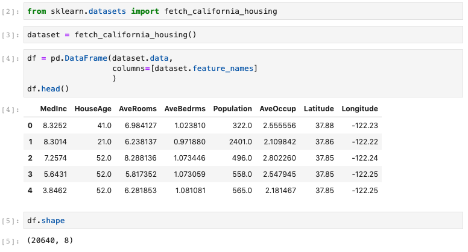 
&nbsp; &nbsp; &nbsp; &nbsp; &nbsp; &nbsp; *fig. 02 ... fetch demo dataset from Sklearn*   

Finally, create the target column “price” (prices, in ``$ 000,000``) which resides in the dataset.target structure. It happens to be placed into a multilevel column index, so I will need to flatten that to one level, as below. I also verified that there were no null values, just to be sure.

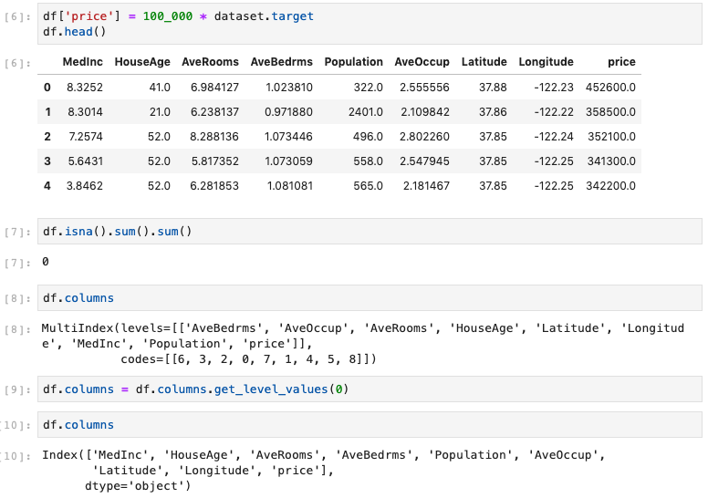 
&nbsp; &nbsp; &nbsp; &nbsp; &nbsp; &nbsp; *fig. 03 ... create target column*   

 

---
 

There aren’t any non-numerical columns in this dataset, but most often, there will be plenty of data cleaning, binarizing, checking datatypes, etc. to do. But that’s not the focus of this post, so let’s assume that has all been done.

Now we’re ready to do some plots! Let’s start with a quick look at the Pearson correlation coefficients. Visualizing on a heatmap is a nice way to go for this task, and I hate looking at the redundant half of the ordinary correlation heatmap, so let’s also mask half of it with a white upper triangle. Here’s the code for the definition, followed by the function-call with the appropriate parameters to label and save the heatmap image as a jpeg file:

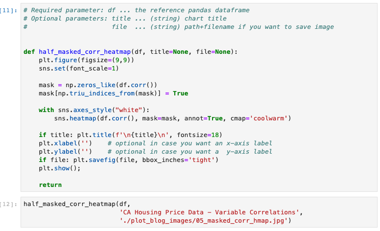 
&nbsp; &nbsp; &nbsp; &nbsp; &nbsp; &nbsp; *fig. 04 ... half-maked correlation heatmap generator function and call*   

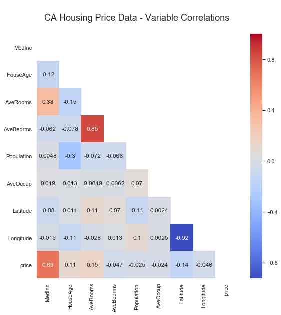 
&nbsp; &nbsp; &nbsp; &nbsp; &nbsp; &nbsp; *fig. 05 ... half-maked correlation heatmap output*   

As you can see, the upper right triangular half of the image is masked. It would simply have been the mirror image of the displayed lower-left half. I chose the colormap “coolwarm” as one that has a nice opposing spectrum of colors for the two opposite extremes, with a neutral color in the middle. Note that each Pearson correlation coefficient is annotated, which can be easily turned off, and that the Seaborn font-scale is set to ‘1’, which is the smallest font setting.

 

---
 

Next, I often want to see correlations of potential features versus a specific target variable, so a variation of the Seaborn heatmap is called for.

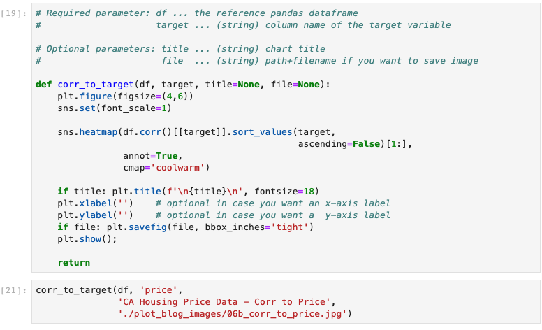 
&nbsp; &nbsp; &nbsp; &nbsp; &nbsp; &nbsp; *fig. 06 ... correlation to target heatmap generator function*   

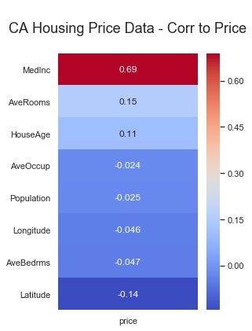 
&nbsp; &nbsp; &nbsp; &nbsp; &nbsp; &nbsp; *fig. 07 ... correlation to target heatmap output*   

 

---
 

Looks like there might be some correlations worth exploring. Do any obvious linear relationships present themselves? A quick survey of scatterplots of each potential feature variable vs. the target is a typical next step. So I use the function below. Note that on line 22, I specified a sequence of 7 colors for the dots of the scatterplots. The function rotates continuously through this list of colors for each subplot in the feature list. Feel free to use the colors you like, and as many as you like.

For this particular CA Housing Prices dataset, I created the input parameter “feature_cols”, which consists of all columns in the dataframe _except_ the target variable “price”. When calling the function, I saved the output image to a .jpg file, and I specified 3 subplots across, since there are 8 features in this dataset. Experiment to see which you prefer. The function defaults to one subplot per row in the figure.

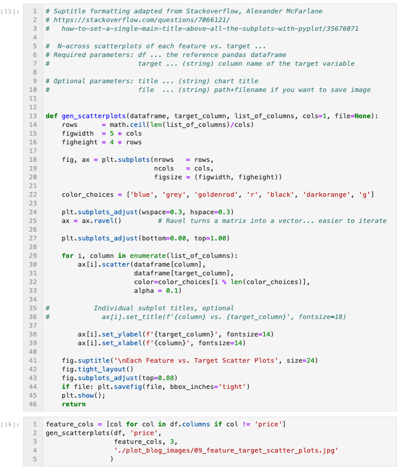 
&nbsp; &nbsp; &nbsp; &nbsp; &nbsp; &nbsp; *fig. 08 ... all features to target scatterplots generator function*   

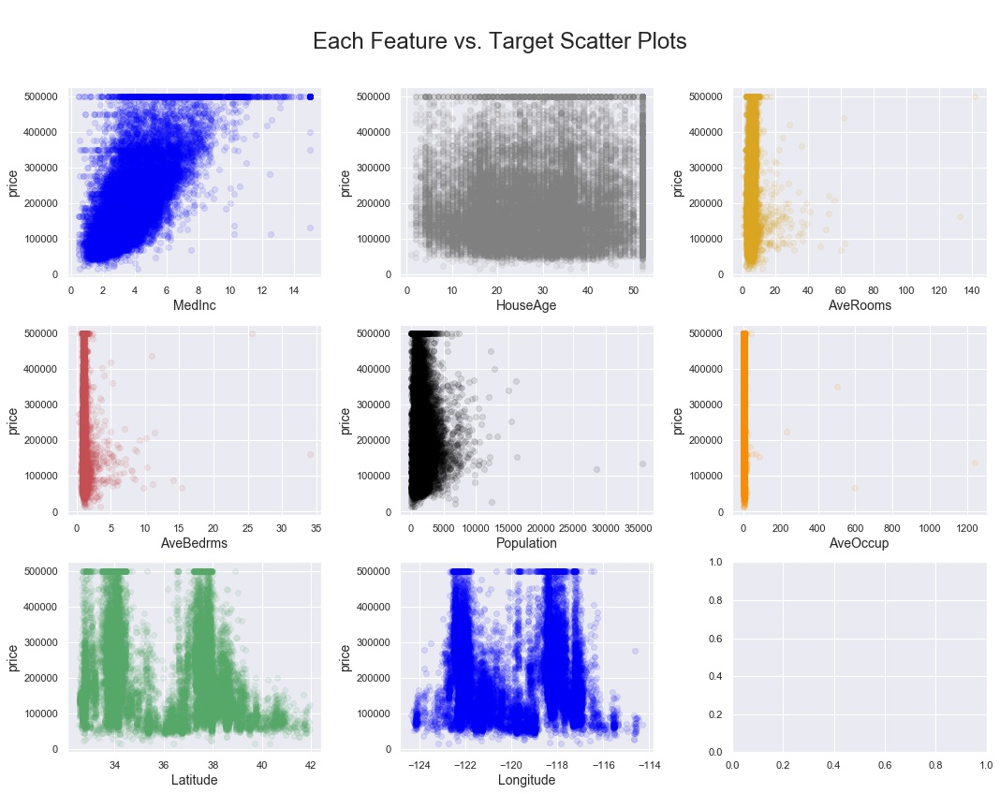 
&nbsp; &nbsp; &nbsp; &nbsp; &nbsp; &nbsp; *fig. 09 ... all features to target scatterplots output*   

 

---
 

But what do the variable observations look like? Do things look normally distributed? Only a statsmodel normal test will give you a definitive answer, but visual inspection is always a good idea. Enter the “generate histograms” function:

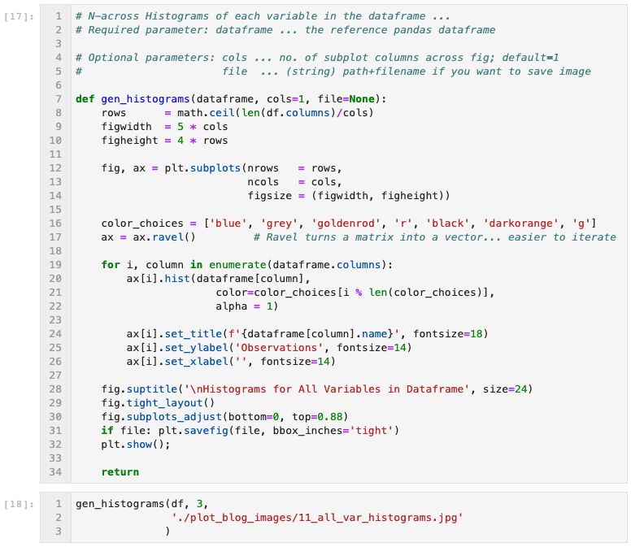 
&nbsp; &nbsp; &nbsp; &nbsp; &nbsp; &nbsp; *fig. 10 ... all variables histogram generator function*   

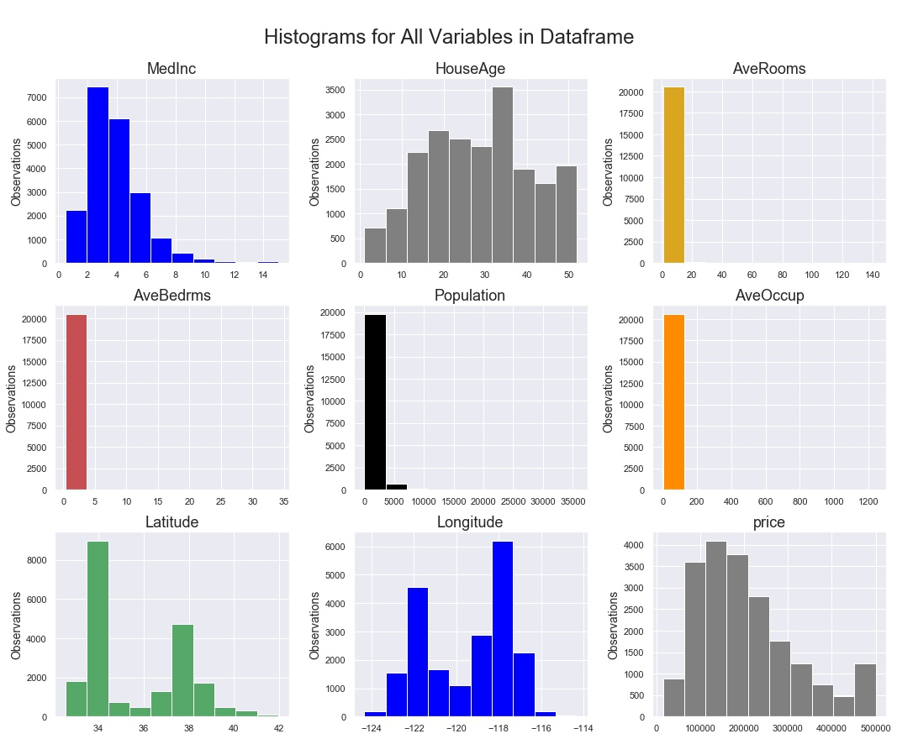 
&nbsp; &nbsp; &nbsp; &nbsp; &nbsp; &nbsp; *fig. 11 ... all variables histograms output*   

 

---
 

But what about the spread of each variable? Outliers? Not to worry, there’s a boxplots function for that!

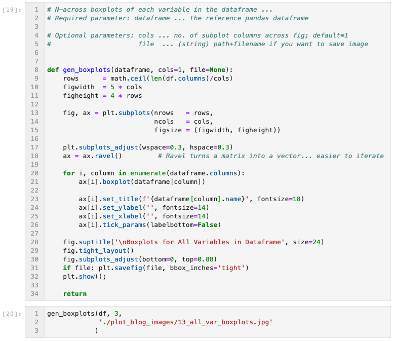 
&nbsp; &nbsp; &nbsp; &nbsp; &nbsp; &nbsp; *fig. 12 ... all variables boxplot generator function*   

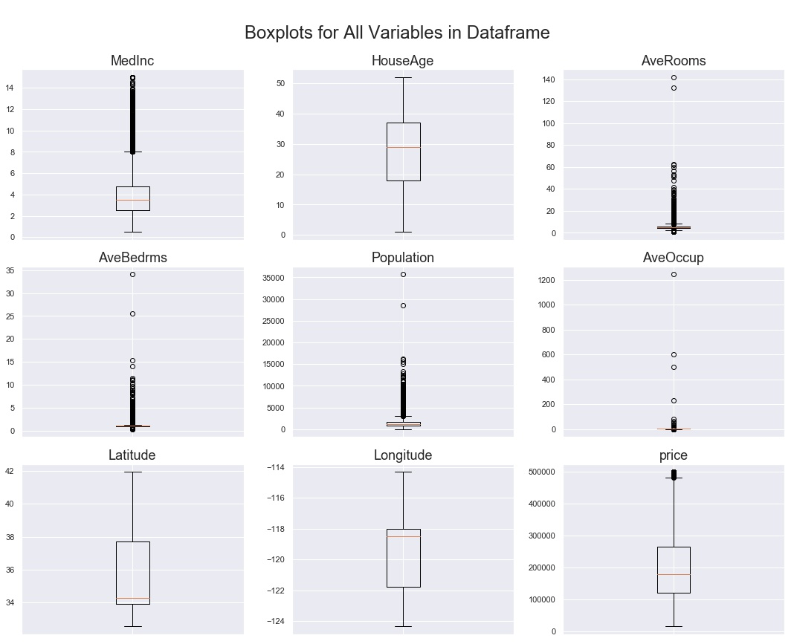 
&nbsp; &nbsp; &nbsp; &nbsp; &nbsp; &nbsp; *fig. 13 ... all variables boxplots output*   

 

---
 

The last pair of functions I will include here are geared more at datasets that might be time-series (date-time) indexed. Rather than import or create a whole new dataset just for demonstration purposes, I’ll apply these line chart functions to our current CA Housing Prices dataset. Just imagine that the index is a date-time range instead of just integers.

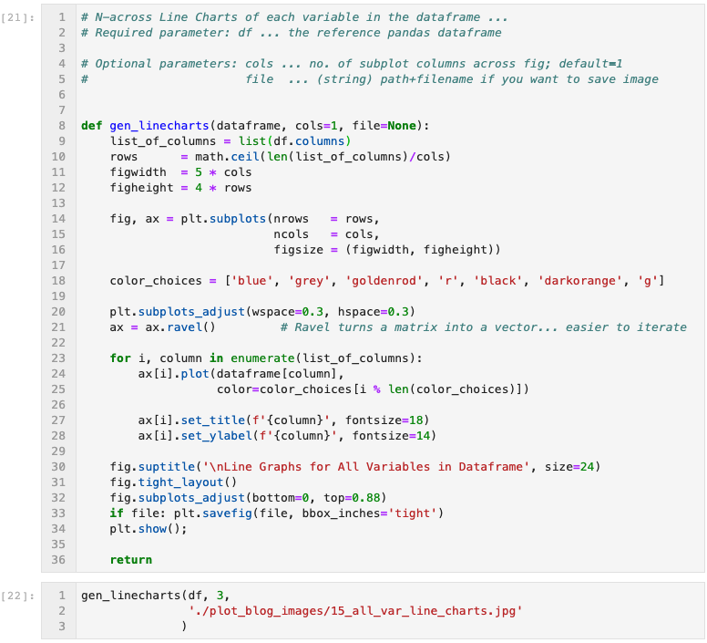 
&nbsp; &nbsp; &nbsp; &nbsp; &nbsp; &nbsp; *fig. 14 ... all variables line charts generator function*   

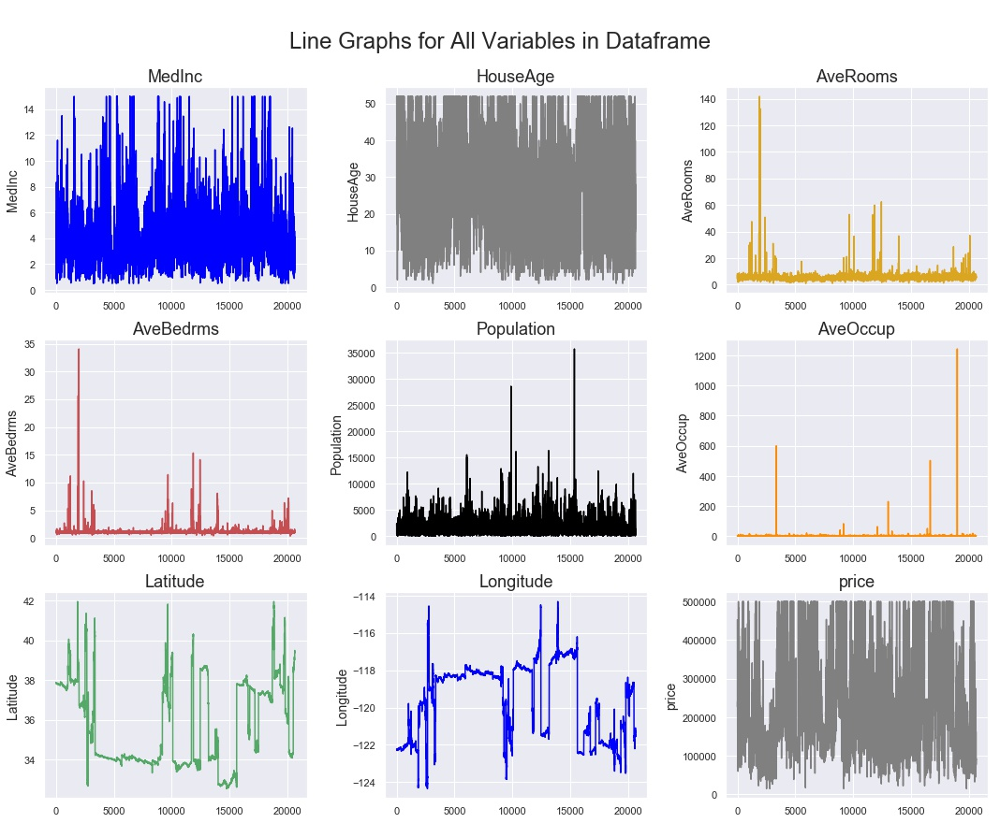 
&nbsp; &nbsp; &nbsp; &nbsp; &nbsp; &nbsp; *fig. 15 ... all variables line charts output*   

Depending on how much data you have, and how granular the time scale, you can see above that trends can be lost in the sheer amount of data visualized. One way to move forward with visual inspection / EDA is to apply a rolling average to the line chart. In the function below, the user specifies the number of periods in the rolling average as one of the input parameters. In this case, I chose 150 periods as an input that brought a little clarity to the charts. You could imagine that if this was a dataset consisting of 30 months worth of hourly observations, a handy one-week rolling average would be 168 periods, so this example is something close to what I have employed in the past.

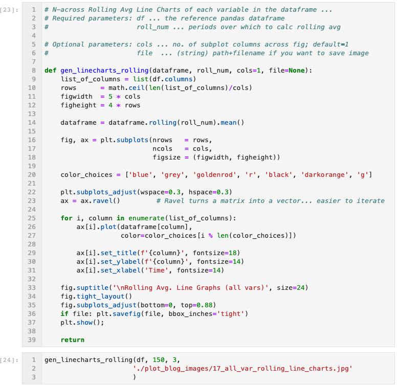 
&nbsp; &nbsp; &nbsp; &nbsp; &nbsp; &nbsp; *fig. 16 ... all variables rolling avg line charts generator function*   

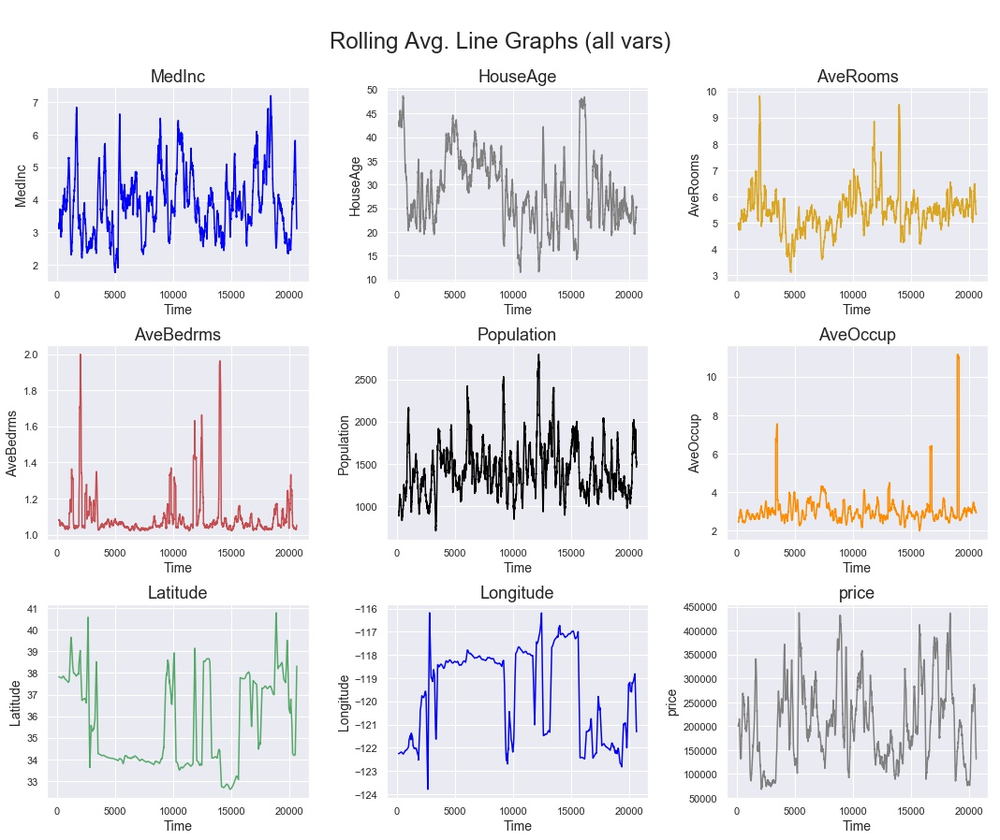 
&nbsp; &nbsp; &nbsp; &nbsp; &nbsp; &nbsp; *fig. 17 ... all variables rolling avg line charts output*   

 

---
 

As you can see, matplotlib does provide for nice control over the format of visualizations, but one can spend too much time on formatting commands, and not enough on the data science. I hope that these functions are useful shortcuts that you can use as the basis for your own customized functions. I left the functions here as python code in Jupyter notebook cells rather than creating a new class object, because I think their utility lies in their quick customizability, rather than in their robustness for every possible data visualization scenario. Happy EDA!

   

---

<footer>

By [Manu Kalia](https://medium.com/@manukalia.sf) on [<time class="dt-published" datetime="2019-06-17T20:41:39.228Z">June 17, 2019</time>](https://medium.com/p/241ba0a9c47d).

[Link to Medium blog-post](https://medium.com/@manukalia.sf/handy-data-visualization-functions-in-matplotlib-seaborn-to-speed-up-your-eda-241ba0a9c47d)

Exported from [Medium](https://medium.com) on June 17, 2019.

</footer>

</article>
